# TIENDA DE BARRIO - PUNTO DE VISTA DE LA ORGANIZACIÓN

## Estudiantes

- **-** Juan Camilo Herrera Ardila - 20211099031
- **-** Andres Arturo Vergara - 20211099039
- **-** Cristian Camilo Roncancio Peña - 20211099036

## Organización tienda
----------------------------------------
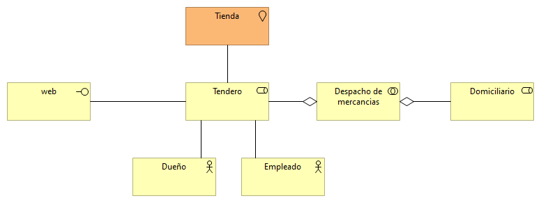

## Organización domicilio
----------------------------------------
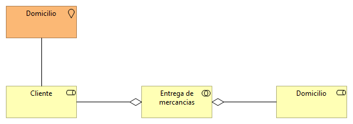

## Cooperación despacho mercancías
----------------------------------------
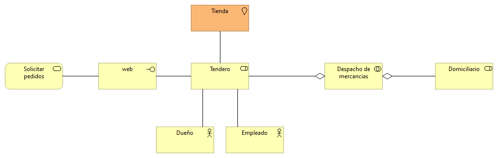

## Funciones de negocio
----------------------------------------
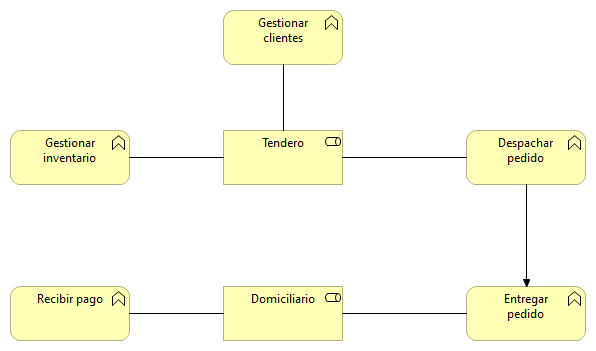

## Procesos de negocio
----------------------------------------
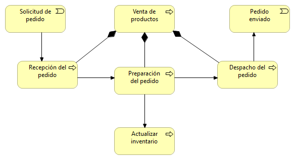

## Cooperación procesos de negocio
----------------------------------------

## Productos
----------------------------------------
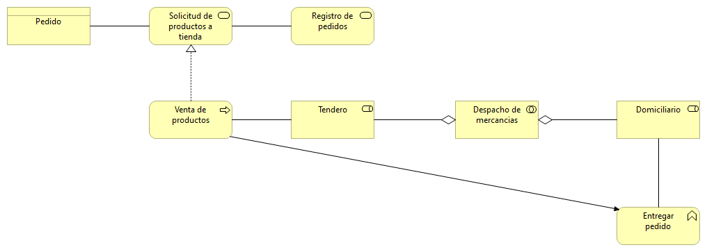

## Comportamiento de aplicación
----------------------------------------

## Por capas
----------------------------------------
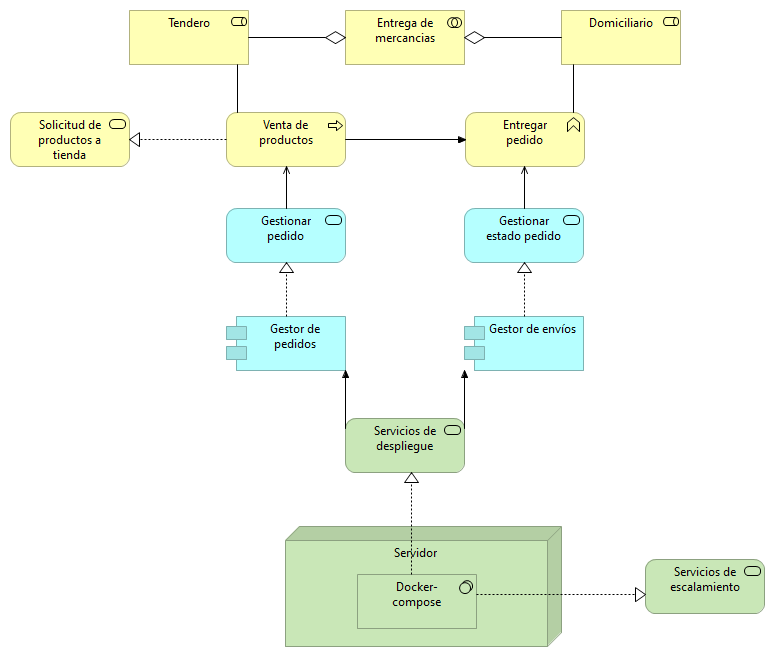

## Estructura de información
----------------------------------------
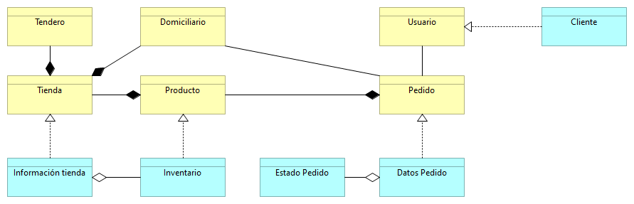

## Realización de servicios
----------------------------------------
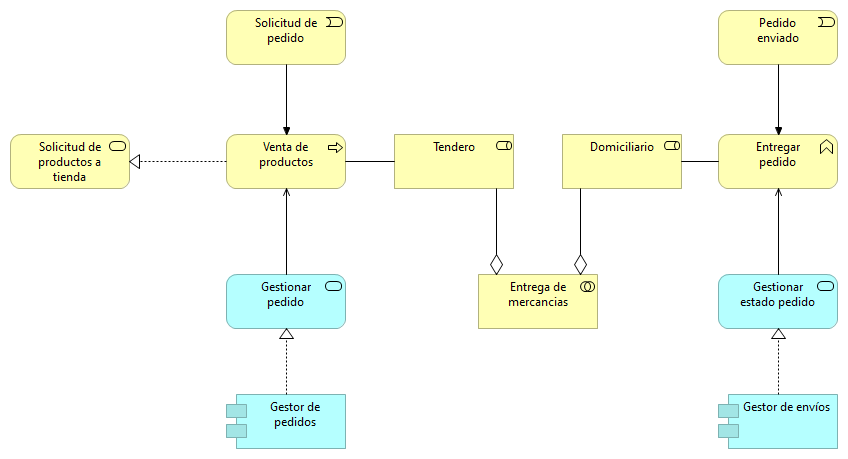

## Uso de aplicación
----------------------------------------
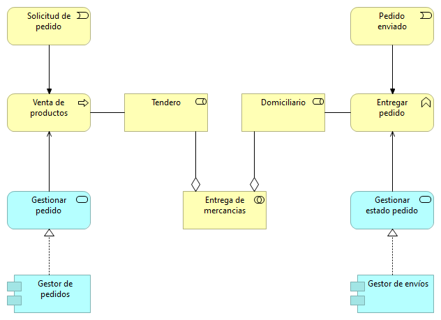

## Estructura de aplicación
----------------------------------------
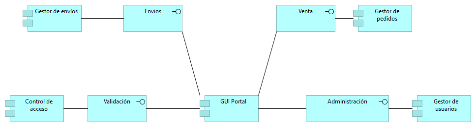

## Infraestructura
----------------------------------------
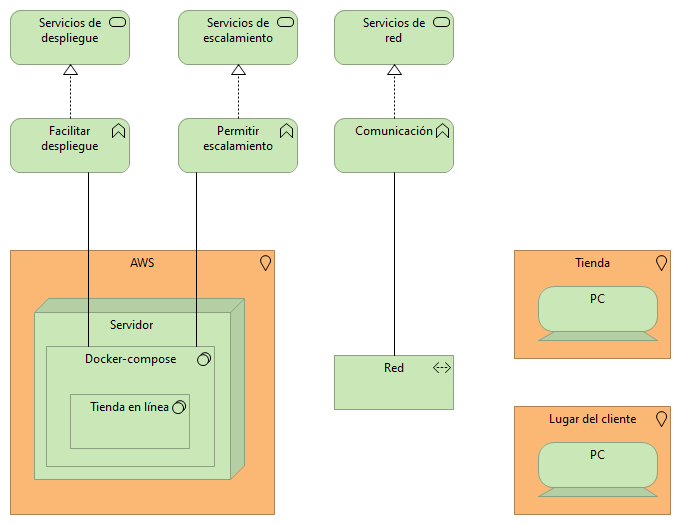

## Uso de infraestructura
----------------------------------------
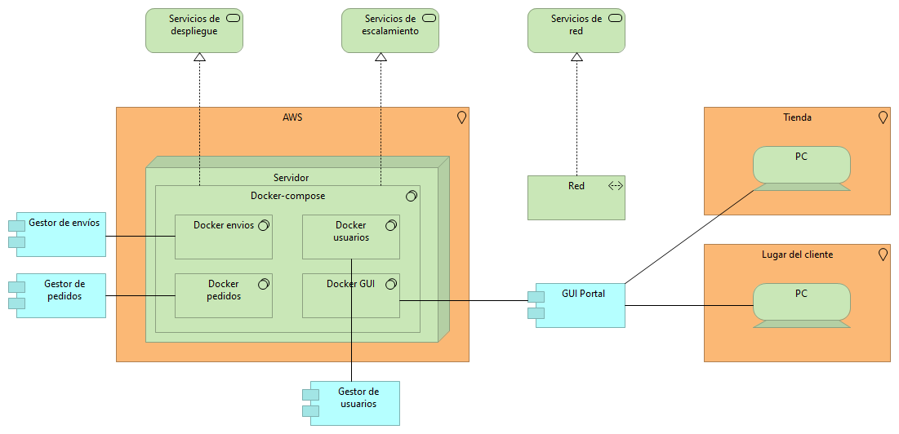

# Organización e implementación
----------------------------------------
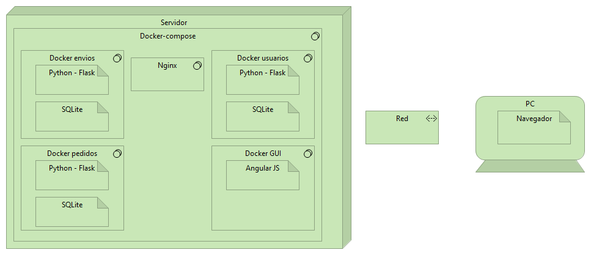

# Cooperación de aplicaciones
----------------------------------------
