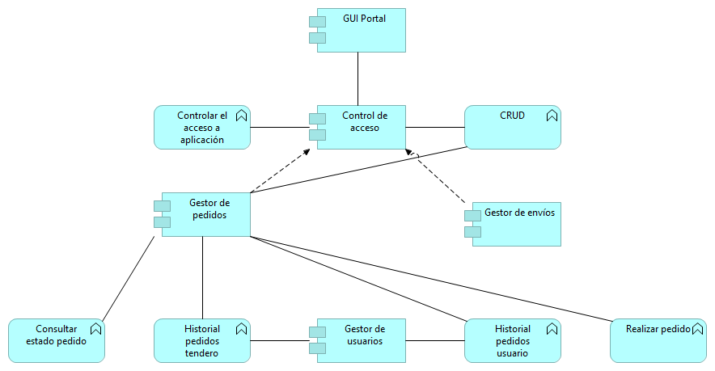

# TIENDA DE BARRIO

## PUNTO DE VISTA DE LA ORGANIZACIÓN

## Estudiantes

- **Juan Camilo Herrera Ardila - 20211099031**
- **Andres Arturo Vergara - 20211099039**
- **Cristian Camilo Roncancio Peña - 20211099036**

## Organización tienda
----------------------------------------

## Organización domicilio
----------------------------------------

## Cooperación despacho mercancías
----------------------------------------

## Funciones de negocio
----------------------------------------

## Procesos de negocio
----------------------------------------

## Cooperación procesos de negocio
----------------------------------------

## Productos
----------------------------------------

## Comportamiento de aplicación
----------------------------------------

## Por capas
----------------------------------------

## Estructura de información
----------------------------------------

## Realización de servicios
----------------------------------------

## Uso de aplicación
----------------------------------------

## Estructura de aplicación
----------------------------------------

## Infraestructura
----------------------------------------

## Uso de infraestructura
----------------------------------------

# Organización e implementación
----------------------------------------

# Cooperación de aplicaciones
----------------------------------------
